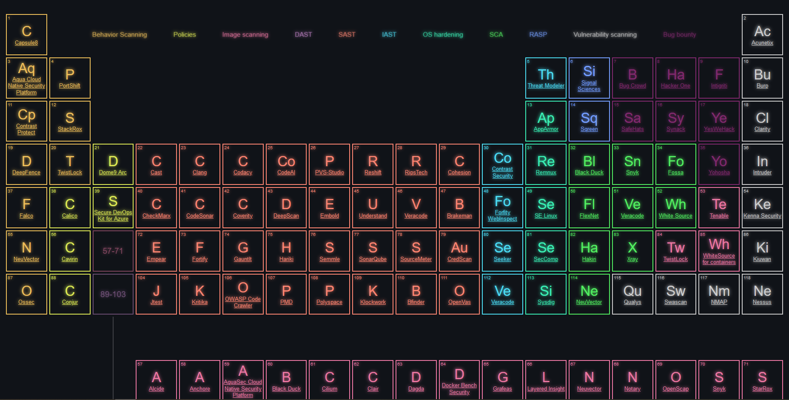

# DevSecOpsTable

Table of DevSecOps elements presenting the current tools of the market. it may not be exhaustive, but it give a rough idea of what could be done to improve your DevSecOps.

[Live result can be accessed here](https://aka.ms/devsecops-table)

## Author

Louis-Guillaume MORAND (http://github.com/lgmorand)

## References

The HTML and the CSS are totally inspired by the great work of Mike Golus (https://codepen.io/mikegolus/pen/OwrPgB)
